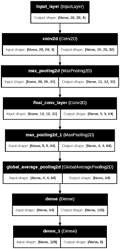
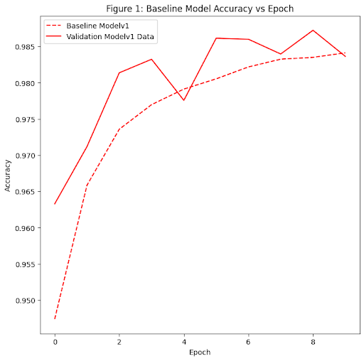
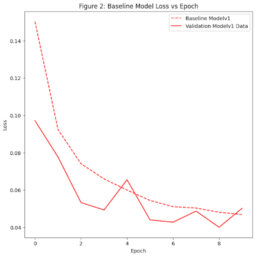
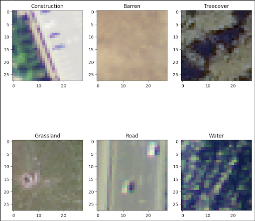

# TOOLS1
Final Project for Data Science Tools 1; University of Denver

## Problem Space
Image classification as a modeling technique has seen an explosion in both application
and sophistication in recent years. Increasingly accurate, lightweight, and fast-performing
image classifiers are used in traffic monitoring, remote sensing, commercial spaces,
threat detection, driving automation, and more. As we become increasingly familiar and integrated
with these technologies, we must be aware of the ability of threat actors to taint results using 
'adversarial', or intentionally obscured, data.

Popular image classification models like convolutional neural networks (CNNs) function by 
understanding patterns within image arrays which can be correlated to output class prediction.
Adversarial actors, or individuals/groups intending to degrade general model performance, or affect
classification frequency of specific classes, often utilize adversarial input images. These 'poisoned' input images
are often indistinguishable from 'clean' input images to the human eye, but have been perturbed in 
some way in order to be intentionally misclassified by the model.

One popular method of data poisoning for image classifiers is called the Fast Gradient Sign Method, 
or FGSM. FGSM calculates the gradient of the loss function, and 'adjusts' the input image 
such that the loss function is maximized by applying a mathematical filter to the input array.
The result is an input image that may look perfectly normal to the human eye, but makes
a classification model perform with much less accuracy than a typical input image.

This capstone project to COMP 4447 aims to demonstrate the effect of this poisoned data- first, by building a simple, yet
>90% accurate convolutional neural network to classify DEEPSAT6 terrain imagery, then generating adversarial inputs
using FGSM, demonstrating the effect of adversarial inputs on model performance, and exploring statistical differences
between the adversarial and clean samples.

## Data Requirements
As this project has been carried out primarily on personal computers, input data must be both:
A: sufficiently coarse for acceptable processing times, and
B: sufficiently ample to build a robust classifier.
Due to a collective interest and background in remote sensing, we selected the DEEPSAT-6 satellite imagery dataset. (Public Domain)
This dataset includes ~405,000 image arrays and labels of dimension (28,28,4). Data fall into one of six terrain 
categories: Barren land, road, construction, treecover, grassland, and water. Data takes roughly 6gB storage altogether.
Available at https://www.kaggle.com/datasets/crawford/deepsat-sat6

## Model Architecture

## Key Insights

Testing accuracy decreased from 94% to 53% in initial modeling efforts with an epsilon value of 1.
Epsilon value is the ‘perturbation’ scaling factor; higher epsilon values return ‘more poisoned’ data. Effective attacks use a low enough epsilon to remain undetected while still disrupting model performance.
With a more robust model, the below shown curve reflects accuracy vs epsilon.

Simple model metrics:
Adversarial Mean: [113.3134  115.37391 114.29599 108.61201]
Adversarial Std: [54.51268  47.67143  36.985027 76.23391 ]
Clean Mean: [113.27197321 115.36691607 114.38267347 109.08337219]
Clean Std: [54.65728377 47.75091567 37.07641239 76.38291389]

Visual differences are near imperceptible:

# Contributors
@sgmurphy00
@psacuh